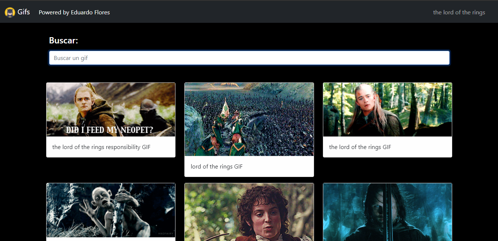
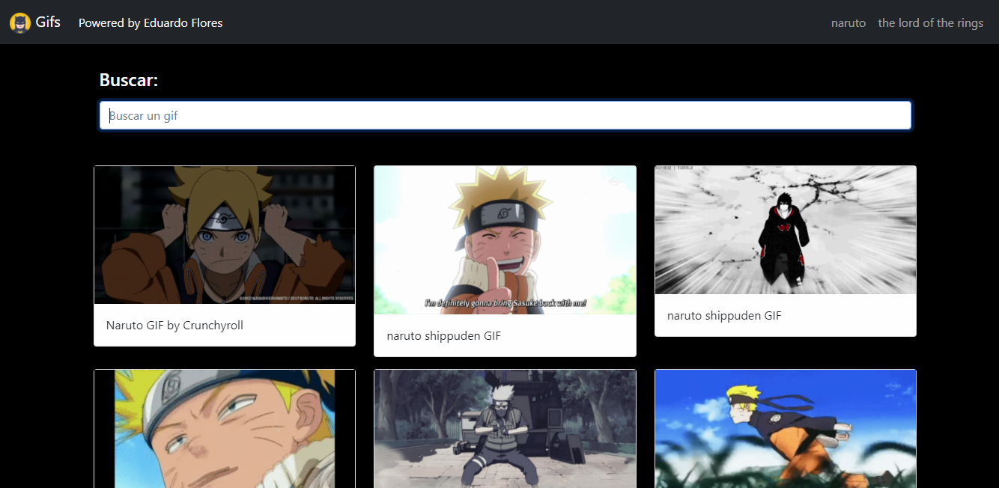
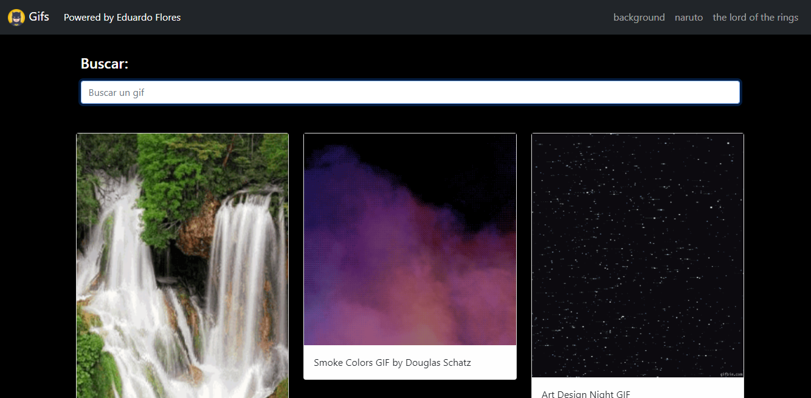

# API Gif

Aplicación desarrollada en **Angular** en donde su enfoque es consumir una **API** mediante peticiones http utilizando el modulo **HttpModule**, así como el servicio **HttpClient**

#### Capturas

